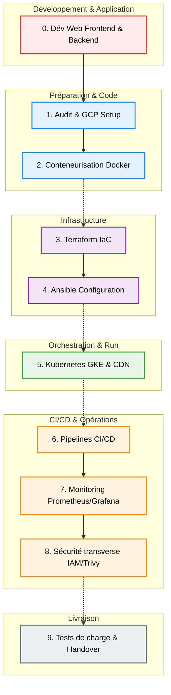

# 🚀 Guide de Stage : Plateforme Cloud Native & DevOps sur GCP

> Ce document est une feuille de route détaillée (Roadmap) pour concevoir et améliorer votre plateforme Cloud Native. Il est découpé en phases chronologiques pour faciliter la réalisation et l'intégration des différentes technologies (Docker, Kubernetes, Terraform, Ansible, CI/CD, etc.).

---

## 🗺️ Parcours Step-by-Step (Workflows en Graphes)

### 1. La Vue d'Ensemble du Projet (Roadmap visuelle)
Voici le flux de travail étape par étape de ce que vous devez faire pour construire la plateforme complète :



### 2. Le Cycle de Vie Applicatif (Architecture CI/CD)
Un aperçu de ce qui va se passer une fois le projet en place :

```mermaid
graph LR
    Dev([👨‍💻 Développeur]) -->|Git Push| VCS[(Git Repo)]
    VCS -->|Trigger| CI[⚙️ Pipeline CI<br/>- Lint/Test<br/>- Build Docker]
    CI -->|Push Image| AR[📦 Google Artifact Registry]
    VCS -->|GitOps| CD[🚀 Pipeline CD<br/>(ArgoCD / Actions)]
    AR -.->|Nouvelle Image| CD
    CD -->|Déploiement| K8S[☸️ Cluster GKE]
    
    K8S -.-> Mon[📊 Prometheus/Grafana]
    Ops([SRE / DevOps]) -.->|Supervise| Mon
```

---

## 💻 Phase 0 : Développement de l'Application Web

Avant de paramétrer le cloud et l'automatisation, la base du projet repose sur la création de l'application (comme le *Employee Management System*).

1. **Développement du Frontend (React / TypeScript) :**
   - Mettre en place l'interface utilisateur (UI) avec des vues structurées et des composants (ex: tableaux de bord, formulaires).
   - Intégrer un système de routage et de gestion d'état (ex: `react-router`, context).
   - Connecter l'application aux API de façon asynchrone pour afficher des données en temps réel aux utilisateurs.
2. **Développement du Backend (NestJS / Node.js) :**
   - Modéliser les données et les connecter à votre base de données réelle (ex: PostgreSQL, MongoDB ou cloud Firebase Firestore).
   - Créer des API robustes pour servir le frontend en garantissant une authentification sécurisée (ex: Signup/Login, JWT).
   - Structurer votre code en différents modules métiers pour une meilleure maintenance (comme le module "Departments").
3. **Tests Qualité et Validation de l'Ensemble :**
   - S'assurer que le Frontend interagit correctement sans erreur CORS avec le Backend.
   - Valider sur machine locale (Localhost) que l'application finale répond au besoin utilisateur avant de l'exporter chez GCP.

---

## 🏗️ Phase 1 : Audit et Préparation (Architecture & GCP)

Avant de commencer l'automatisation de son déploiement, une base solide du système Cloud est nécessaire.

1. **Audit de l'application existante :**
   - Cartographier l'application (Frontend, Backend, Base de données).
   - Recenser les variables d'environnement, les ports réseau et les dépendances.
2. **Configuration initiale de GCP :**
   - Créer un projet **Google Cloud Platform**.
   - Activer les API requises (`Compute Engine`, `Kubernetes Engine`, `Cloud Storage`, `Artifact Registry`).
   - Configurer le **IAM (Identity and Access Management)**: Créer un Service Account (compte de service) dédié pour Terraform et la CI/CD avec l'approche du *moindre privilège*.
3. **Organisation du Repository Git :**
   - `src/` : Code source et Dockerfiles
   - `infrastructure/` : Code Terraform
   - `k8s/` ou `helm/` : Manifests Kubernetes
   - `ansible/` : Playbooks de configuration
   - `.github/workflows/` (ou gitlab-ci) : Pipelines CI/CD

---

## 🐳 Phase 2 : Conteneurisation (Docker)

Rendre l'application portable et indépendante de l'environnement matériel.

1. **Création des Dockerfiles :**
   - Rédiger des Dockerfiles basés sur des "Multi-stage builds" pour minimiser le poids des images.
2. **Tests Locaux avec Docker Compose :**
   - Créer un fichier `docker-compose.yml` qui permet à un développeur de lancer toute l'architecture (DB + Back + Front) localement via un simple `docker-compose up`.
   - Mettre en place un `.dockerignore` pour exclure les répertoires inutiles (comme `node_modules`).

---

## 🌍 Phase 3 : Infrastructure as Code (Terraform)

Automatiser la création de votre infrastructure Cloud pour la rendre reproductible et auditable.

> **Astuce** : Ne stockez jamais l'état de Terraform (`.tfstate`) sur votre machine locale en production. Stockez ce state dans un cloud de manière sécurisée.

1. **Initialisation et Remote State :**
   - Utiliser un bucket GCS (Google Cloud Storage) pour le backend de Terraform.
2. **Conception Réseau (VPC) :**
   - Créer un VPC Custom sur GCP.
   - Définir des sous-réseaux (Subnets) **privés** pour vos clusters Kubernetes.
   - Configurer un **Cloud Router** et un **Cloud NAT** (Pour permettre aux ressources privées de télécharger des mises à jour sur internet).
3. **Création du cluster Kubernetes (GKE) :**
   - Provisionner un Cluster GKE privé (Private Cluster) pour la sécurité.
   - Configurer les Node Pools pour prendre en compte le provisionnement multi-zones (Haute disponibilité).
4. **Autres ressources :**
   - Créer un **Artifact Registry** pour stocker vos images Docker et configurer les Buckets.

---

## ⚙️ Phase 4 : Configuration Automatisée (Ansible)

Dans un contexte Kubernetes, Ansible sert surtout pour préparer les environnements autour du Cloud Native.

1. **Configuration des Hosts Dédiés :**
   - Si l'infrastructure inclut une **VM Bastion** (Jump Host) pour accéder au GKE privé en toute sécurité en SSH, utilisez Ansible pour la configurer de base (installation des outils `kubectl`, Helm, création de comptes locaux, sécurisation SSH).
2. **Automatisation CI/CD Runner :**
   - Vous pouvez également créer un playbook Ansible pour provisionner et installer un runner auto-hébergé pour les serveurs Git.

---

## ☸️ Phase 5 : Déploiement Kubernetes, Scalabilité & CDN

C'est ici que l'application prend vie de manière résiliente.

1. **Manifests Kubernetes (ou charte Helm) :**
   - **Deployments** : Gèrent les pods du backend et du frontend.
   - **Services** (ClusterIP / NodePort) : Lient les pods entre eux de manière sécurisée (ex: le Front communique avec l'API Back).
   - **ConfigMaps & Secrets** : Gèrent vos variables d'environnement.
2. **Ingress & Load Balancer :**
   - Configurer un **Ingress Controller** (NGINX ou GCE) qui va piloter la création d'un **Load Balancer GCP** externe ou interne.
   - Lier l'Ingress aux services pour faire de la terminaison SSL.
3. **Optimisations, Haute Dispo (HA) et Performances :**
   - Activer **Cloud CDN** sur le load-balancer pour mettre en cache votre application Front.
   - Déployer vos pods dans diverses Availability Zones.
   - Mettre en place de l'auto-scaling applicatif : configurer les **HPA (Horizontal Pod Autoscaler)** sur vos pods pour qu'il scale automatiquement si la RAM ou le CPU dépasse les 70%-80%.

---

## 🔁 Phase 6 : Intégration et Déploiement Continus (CI/CD)

Automatiser les tests et la livraison en production (GitHub Actions ou GitLab CI).

1. **Pipeline d'intégration Continue (CI) :**
   - Linting du code source et de Terraform (`tflint`).
   - Build et exécution des tests automatiques lors d'un "Push".
   - Création de l'image Docker avec un "tag" dynamique (selon le commit ou le tag git), puis faire un 'Push' de l'image vers Google Artifact Registry.
2. **Pipeline de Déploiement Continu (CD) :**
   - Déploiement automatisé : Mise à jour de la nouvelle balise d'image dans le déploiement Kubernetes.
   - **Méthode Moderne recommandée (GitOps)** : Mettre en place un outil tel qu'**ArgoCD** dans GKE qui observera continuellement un répertoire GIT. Dès que le paramètre d'image est incrémenté, l'outil s'occupe de faire le pull et d'y appliquer sur le cluster de façon fluide.

---

## 📊 Phase 7 : Monitoring & Observabilité

Assurer que le système fonctionne parfaitement tout le temps, et anticiper les anomalies.

1. **Installation du couple Prometheus / Grafana :**
   - Intégrer l'opérateur Helm communautaire : `kube-prometheus-stack` sur le cluster.
   - **Prometheus** collectera en tâche de fond les métriques hardware & applicatives.
   - **Grafana** fournira vos visualisations.
2. **Mise en place de Dashboards Clés :**
   - Créer un dashboard pour afficher votre "Cluster" : Nodes en santé, Pods crashé, CPU/RAM consommé globalement.
   - Créer un dashboard applicatif : requêtes/s, latences, erreurs 4xx et 5xx.
3. **Alerting :**
   - Configurer **AlertManager** : Si un nœud du cluster tombe en panne, il envoie un e-mail ou une notification Slack automatique à l'équipe DevOps.

---

## 🛡️ Phase 8 : Sécurité (Transverse)

> **Attention** : Vos bases de données ou panneaux d'administration ne doivent **pas** être exposés sur le web.

1. **Gestion IAM GCP et RBAC (Kubernetes) :**
   - Utiliser la fonctionnalité **Workload Identity** (GCP) pour associer finement une identité GCP à un "ServiceAccount" K8s.
2. **Secrets Management :**
   - Ne validez jamais de clés/mots de passe dans le répertoire Git. Solutions recommandées : **Sealed Secrets**, ou bien utiliser un **External Secrets Operator** synchronisé avec le backend **GCP Secret Manager**.
3. **Analyse de la chaîne d'approvisionnement (Supply Chain) :**
   - Intégrer Trivy, Snyk, ou le scanner natif d'Artifact Registry pour bloquer les images contenant des défauts de dépendances connus.

---

## 🎯 Phase 9 : Tests, Documentation et Validation Finale

À l'issue du stage :
- [ ] **Reprise après Sinistre** : Simuler une grosse panne de production. Vérifiez que Terraform recrée un cluster net et précis, et que la configuration s'installe.
- [ ] **Tests de Stress/Charge** : Simuler de la charge HTTP artificiellement (avec des outils comme locaux *Locust* ou *K6*) pour prouver de façon tangible l'auto-scaling du cluster GKE en live en regardant les graphes s'élever.
- [ ] **Documentation et Handover** : Documenter la structure de l'infrastructure et la gestion des logs/sauvegardes dans le Wiki du projet ou `README.md`.
